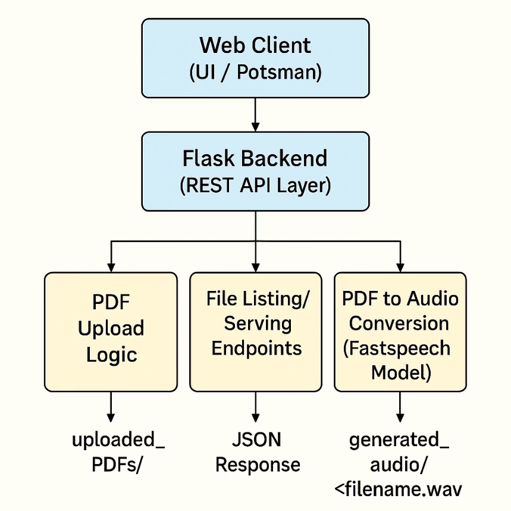

# Multilingual PDF To Audio Using FastSpeech2_HS

This project is a web application that converts PDF files to audio using the FastSpeech2_HS model. It supports multiple languages.

## Features

*   Upload PDF files.
*   Convert PDF text to speech in multiple languages.
*   Generate and play audio files.

## Sample Demo

[hello.mp3](https://github.com/user-attachments/files/26341358/hello.mp3)

*Note: The output generated by the models is a .wav file extension.*


## Technologies Used

*   Python
*   Flask
*   FastSpeech2_HS
*   gunicorn
*   torch
*   espnet
*   pandas
*   matplotlib
*   indic-num2words

## Installation

1.  **Clone the repository:**
    ```bash
    git clone <repository-url>
    cd PDF-To-Audio-Fastspeech2
    ```

2.  **Create and activate a virtual environment:**
    ```bash
    python3 -m venv venv
    source venv/bin/activate  # On Windows, use `venv\Scripts\activate`
    ```

3.  **Install the dependencies:**
    ```bash
    pip install -r requirements.txt
    ```
    Alternatively, you can use conda with the `environment.yml` file:
    ```bash
    conda env create -f environment.yml
    conda activate <env_name>
    ```

## Models

To use this application, you need to download the pre-trained FastSpeech2_HS models. You can find these models on Hugging Face.

1.  **Download the models:**
    Go to the following Hugging Face repository:
    [https://huggingface.co/smtiitm/Fastspeech2_HS/tree/main](https://huggingface.co/smtiitm/Fastspeech2_HS/tree/main)

2.  **Create the model directories:**
    Create a `models` directory in the root of the project, and inside it, create subdirectories for each language you want to support. For example:
    ```
    models/
    ├── punjabi/
    ├── telugu/
    └── urdu/
    ```

3.  **Place the models in the correct directories:**
    Download the model files and place them in the corresponding language directory. For example, the Urdu model files should be placed in the `models/urdu/` directory.

    Ensure the final structure looks like this:
    ```
    models/
    └── urdu/
        ├── male / model
        └── female / model
    ```

## Usage

1.  **Run the Flask application:**
    ```bash
    python app.py
    ```

2.  **Open your web browser and navigate to:**
    ```
    http://127.0.0.1:5000
    ```

## Project Structure
```
.
├── .gitignore
├── environment.yml
├── README.md
├── requirements.txt
├── data/
|   ├── generated-audio/
|   ├── uploaded_PDFs
|   ├── multilingualcharmap.json
├── src/
|   ├── app.py
|   ├── get_phone_mapped_python.py
|   ├── inference.py
|   ├── text_preprocess_for_inference.py
├── templates/
    ├── web_ui_2.html
├── tmp/
└── models/
```

## Project Architecture

<div align="center">
  
</div>
